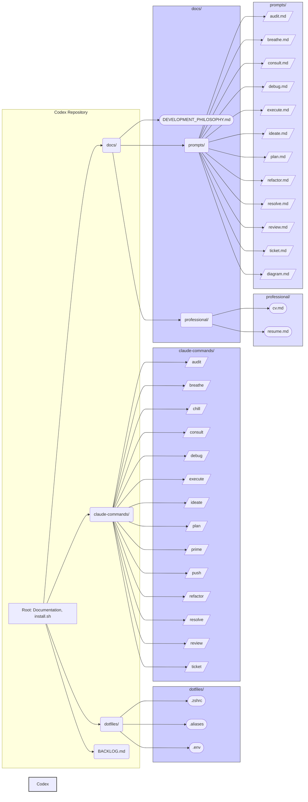

### Explanation

This Mermaid diagram visualizes the structure of the `codex` repository.

-   **Codex Repository**: The central container, encompassing all other components.
-   **Subdirectories**: `dotfiles`, `claude-commands`, and `docs` represent key functional areas.
-   **Files**: Individual files within each subdirectory are listed as nodes.
-   **Subgraphs**: `dotfiles`, `claude-commands`, `docs`, `professional`, and `prompts` are grouped into subgraphs for clarity.
-   **Relationships**: Arrows indicate the hierarchical structure.

### Key Insights

-   The repository is well-organized, with clear separation of concerns.
-   The `claude-commands` and `prompts` directories are closely related, indicating a structured approach to AI-assisted development.
-   The `DEVELOPMENT_PHILOSOPHY.md` file in the `docs` directory is central to the project's standards and guidelines.
-   The `dotfiles` directory manages environment configurations for consistency.
